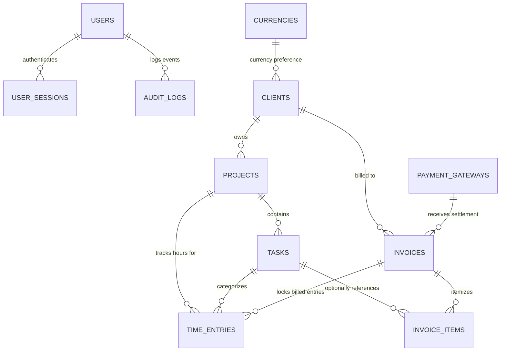

# 🗄️ Manager-X Database Architecture & Entity Relationships

This document provides a comprehensive map of the **Manager-X** database schema, illustrating how tables connect, foreign key cascades function, and data flows across the application.

---

## 🧭 1. High-Level Entity Relationship Diagram (ERD)

The diagram below maps all active tables in the SQLite database (`manager_x.db`) and their relational cardinality:



---

## 🏛️ 2. Domain Clusters & Table Details

### A. Operations & Time Tracking Domain
This domain manages clients, project work breakdown structures, and billable time logs.

```mermaid
graph TD
    Client["🏢 clients<br/>(id: cli_*)"] -->|1:N| Project["📁 projects<br/>(id: prj_*)"]
    Project -->|1:N (CASCADE)| Task["✅ tasks<br/>(id: tsk_*)"]
    Project -->|1:N (CASCADE)| TimeEntry["⏱️ time_entries<br/>(id: tim_*)"]
    Task -->|1:N| TimeEntry
```

1. **`clients`** (`cli_*`):
   - **Role**: Master client profile (company name, contact person, billing address, tax ID, payment terms).
   - **Key Fields**: `id`, `company_name`, `email`, `currency_code` (FK $\rightarrow$ `currencies.code`), `hourly_rate`, `payment_terms_days`.
   - **Outgoing Relations**:
     - $\rightarrow$ `projects` (One-to-Many): A client can have multiple projects.
     - $\rightarrow$ `invoices` (One-to-Many): Invoices are issued to specific clients.

2. **`projects`** (`prj_*`):
   - **Role**: Client contracts, milestones, and deliverables.
   - **Key Fields**: `id`, `client_id` (FK $\rightarrow$ `clients.id`), `name`, `billing_type` (`hourly` | `fixed` | `internal`), `hourly_rate`, `budget_amount`, `status`.
   - **Rate Cascade**: If `hourly_rate` is left null, projects automatically inherit the client's default `hourly_rate`.

3. **`tasks`** (`tsk_*`):
   - **Role**: Actionable deliverables within a project.
   - **Key Fields**: `id`, `project_id` (FK $\rightarrow$ `projects.id`), `title`, `status` (`backlog`, `in_progress`, `review`, `done`), `priority`, `estimated_hours`, `checklist` (`JSON` array of sub-items).
   - **Cascade**: Deleting a project automatically cascades and deletes its tasks.

4. **`time_entries`** (`tim_*`):
   - **Role**: Atomic time tracking logs (both live stopwatch and manual entries).
   - **Key Fields**: `id`, `project_id` (FK), `task_id` (FK), `start_time`, `end_time`, `duration_seconds`, `is_billable`, `hourly_rate`, `invoiced`, `invoice_id` (FK $\rightarrow$ `invoices.id`).
   - **Billing Lock**: When an invoice is created, all associated `time_entries` are flagged with `invoiced = true` and linked via `invoice_id`.

---

### B. Invoicing, Payments & Settlement Domain
This domain manages financial billing, multi-currency invoicing, and payment reconciliation.

```mermaid
graph TD
    Client["🏢 clients"] -->|1:N| Invoice["📄 invoices<br/>(id: inv_*)"]
    Gateway["💳 payment_gateways<br/>(id: gw_*)"] -->|1:N (SET NULL)| Invoice
    Invoice -->|1:N (CASCADE)| InvoiceItem["📦 invoice_items<br/>(id: ini_*)"]
    Task["✅ tasks"] -.->|0..1:N (SET NULL)| InvoiceItem
    Invoice -.->|1:N (SET NULL)| TimeEntry["⏱️ time_entries"]
```

1. **`invoices`** (`inv_*`):
   - **Role**: Official billing document issued to a client.
   - **Key Fields**:
     - `id`, `invoice_number` (Unique, e.g. `INV-2026-001`).
     - `client_id` (FK $\rightarrow$ `clients.id`).
     - `status`: `draft` $\rightarrow$ `sent` $\rightarrow$ `paid` $\rightarrow$ `overdue` $\rightarrow$ `void`.
     - `currency_code` (e.g. `USD`, `EUR`, `INR`).
     - `subtotal`, `discount_type`, `discount_value`, `discount_amount`, `round_off`, `final_amount`.
     - `payment_gateway_id` (FK $\rightarrow$ `payment_gateways.id`).
     - `received_amount_inr`: Exact foreign exchange converted amount received in INR.
     - `payment_date`: Date payment was settled.
     - `is_reconciled`: Boolean flag for bank statement reconciliation.
     - `bank_transaction_id`: Bank reference / UTR / wire number.

2. **`invoice_items`** (`ini_*`):
   - **Role**: Individual line items on an invoice.
   - **Key Fields**: `id`, `invoice_id` (FK $\rightarrow$ `invoices.id`), `task_id` (FK $\rightarrow$ `tasks.id`, nullable), `description`, `hsn_sac`, `quantity`, `unit_price`, `total`, `sort_order`.
   - **Cascade**: Deleting an invoice automatically deletes all its line items (`CASCADE`).

3. **`payment_gateways`** (`gw_*`):
   - **Role**: Directory of collection methods (Razorpay, Stripe, PayPal, Wire Transfer).
   - **Key Fields**: `id`, `name`, `currency_code`, `total_incoming_amount`, `total_equivalent_inr`, `average_rate`, `gateway_note`, `is_active`.
   - **Integration**: Gateway wire instructions (`gateway_note`) are dynamically embedded into server-generated invoice PDFs.

---

### C. Security, Authentication & Audit Domain
This domain manages administrative authentication, token invalidation, and brute-force defenses.

```mermaid
graph TD
    User["👤 users<br/>(id: UUID)"] -->|1:N (CASCADE)| UserSession["🔑 user_sessions<br/>(token_jti)"]
    User -->|1:N (SET NULL)| AuditLog["📜 audit_logs<br/>(security events)"]
```

1. **`users`**:
   - **Role**: Administrator accounts with Argon2id password hashing.
   - **Key Fields**: `id`, `email` (Unique), `hashed_password`, `full_name`, `is_active`, `is_superuser`, `failed_login_attempts`, `locked_until`.
   - **Security**: Account automatically locks for 15 minutes after 5 consecutive failed login attempts.

2. **`user_sessions`**:
   - **Role**: Active JWT sessions tracked in the database for instant server-side revocation.
   - **Key Fields**: `id`, `user_id` (FK $\rightarrow$ `users.id`), `token_jti` (Cryptographic JWT Token ID), `ip_address`, `user_agent`, `expires_at`, `is_revoked`.

3. **`audit_logs`**:
   - **Role**: Immutable record of authentication events (`LOGIN_SUCCESS`, `LOGIN_FAILED`, `ACCOUNT_LOCKED`, `LOGOUT`).
   - **Key Fields**: `id`, `user_id` (FK $\rightarrow$ `users.id`), `event_type`, `ip_address`, `user_agent`, `details`, `created_at`.

---

### D. System Configuration & Master Data Domain

1. **`currencies`**:
   - **Role**: Dynamic currency lookup table enforcing the **zero-hardcoding** architecture.
   - **Key Fields**: `code` (PK: `INR`, `USD`, `EUR`, `GBP`), `symbol` (`₹`, `$`, `€`, `£`), `name`, `is_base_currency`, `is_active`.
   - **Referenced By**: `clients.currency_code`, `payment_gateways.currency_code`.

2. **`system_settings`**:
   - **Role**: Key-value settings registry.
   - **Key Fields**: `key` (PK, e.g. `company_profile`, `countries`, `theme`), `value` (Text / JSON payload), `category`, `updated_at`.

---

## 🔗 3. Complete Foreign Key Relationship & Cascade Matrix

| Source Table | Foreign Key Column | Target Table | Target Primary Key | Cardinality | On Delete Behavior | Business Purpose |
| :--- | :--- | :--- | :--- | :--- | :--- | :--- |
| **`clients`** | `currency_code` | `currencies` | `code` | N : 1 | `RESTRICT` | Binds client billing to an active currency. |
| **`projects`** | `client_id` | `clients` | `id` | N : 1 | `RESTRICT` | Deleting a client in use is blocked by referential protection. |
| **`tasks`** | `project_id` | `projects` | `id` | N : 1 | `CASCADE` | Tasks belong strictly to a project; removing project cleans tasks. |
| **`time_entries`** | `project_id` | `projects` | `id` | N : 1 | `CASCADE` | Logs belong to a project. |
| **`time_entries`** | `task_id` | `tasks` | `id` | N : 1 | `SET NULL` / `RESTRICT` | Deleting a task keeps hours on project level. |
| **`time_entries`** | `invoice_id` | `invoices` | `id` | N : 1 | `SET NULL` | Unlocks tracked time if an invoice is deleted or voided. |
| **`invoices`** | `client_id` | `clients` | `id` | N : 1 | `RESTRICT` | Invoices require a valid client; client deletion is blocked. |
| **`invoices`** | `payment_gateway_id` | `payment_gateways` | `id` | N : 1 | `SET NULL` | Removing a gateway preserves invoice settlement records. |
| **`invoice_items`**| `invoice_id` | `invoices` | `id` | N : 1 | `CASCADE` | Line items belong strictly to an invoice. |
| **`invoice_items`**| `task_id` | `tasks` | `id` | N : 1 | `SET NULL` | Line items linked to tasks detach cleanly if task is deleted. |
| **`user_sessions`**| `user_id` | `users` | `id` | N : 1 | `CASCADE` | Deleting a user immediately purges all active session tokens. |
| **`audit_logs`** | `user_id` | `users` | `id` | N : 1 | `SET NULL` | Security audit trail remains preserved even if user is removed. |

---

## 🔄 4. Real-World Lifecycle Data Flows

### Flow 1: Client Onboarding $\rightarrow$ Task Execution
```text
1. [currencies] (e.g. "USD")
       │
       ▼
2. [clients] created with currency_code="USD", hourly_rate=50.0
       │
       ▼
3. [projects] created under client with billing_type="hourly" (inherits rate: 50.0)
       │
       ▼
4. [tasks] created with title, checklist JSON, and estimated_hours=10.0
       │
       ▼
5. [time_entries] logged against task & project via live stopwatch or manual entry
   (status: invoiced=false, invoice_id=null)
```

### Flow 2: Invoicing $\rightarrow$ Settlement $\rightarrow$ Payment Undo
```text
1. User creates [invoices] for Client
       │
       ├─► [invoice_items] added for tracked tasks
       └─► Linked [time_entries] updated: invoiced=true, invoice_id=inv.id
       │
2. Client sends payment via [payment_gateways] (e.g., Stripe Wire)
       │
       ├─► Invoice status updated: status="paid"
       ├─► received_amount_inr=83500.0, payment_date="2026-10-08"
       └─► Gateway totals updated: total_incoming_amount, total_equivalent_inr
       │
3. Optional Undo: User clicks "Undo Paid"
       │
       └─► Invoice status rolled back to "sent", received_amount_inr=null
```

---

## 🆔 5. Identifier Standards (CUID vs UUID)

To prevent collision risks, ensure URL safety, and guarantee chronologically sortable keys:

| Entity | ID Type | Format / Example | Generator |
| :--- | :--- | :--- | :--- |
| **`User`** | UUID v4 | `9b1deb4d-3b7d-4bad-9bdd-2b0d7b3dcb6d` | Python `uuid.uuid4()` |
| **`UserSession`** | UUID v4 | `f47ac10b-58cc-4372-a567-0e02b2c3d479` | Python `uuid.uuid4()` |
| **`AuditLog`** | UUID v4 | `c9a646d3-9c61-4cc9-bc18-406a1253af27` | Python `uuid.uuid4()` |
| **`Client`** | CUID | `cli_c29b7a...` | `app.core.cuid.generate_cuid("cli_")` |
| **`Project`** | CUID | `prj_c29b7a...` | `app.core.cuid.generate_cuid("prj_")` |
| **`Task`** | CUID | `tsk_c29b7a...` | `app.core.cuid.generate_cuid("tsk_")` |
| **`TimeEntry`** | CUID | `tim_c29b7a...` | `app.core.cuid.generate_cuid("tim_")` |
| **`Invoice`** | CUID | `inv_c29b7a...` | `app.core.cuid.generate_cuid("inv_")` |
| **`InvoiceItem`** | CUID | `ini_c29b7a...` | `app.core.cuid.generate_cuid("ini_")` |
| **`PaymentGateway`** | CUID | `gw_c29b7a...` | `app.core.cuid.generate_cuid("gw_")` |
| **`Currency`** | ISO Code | `USD`, `INR`, `EUR`, `GBP` | Natural ISO Code |
| **`SystemSetting`**| Semantic Key| `company_profile`, `theme`, `countries` | Natural Snake_Case Key |
