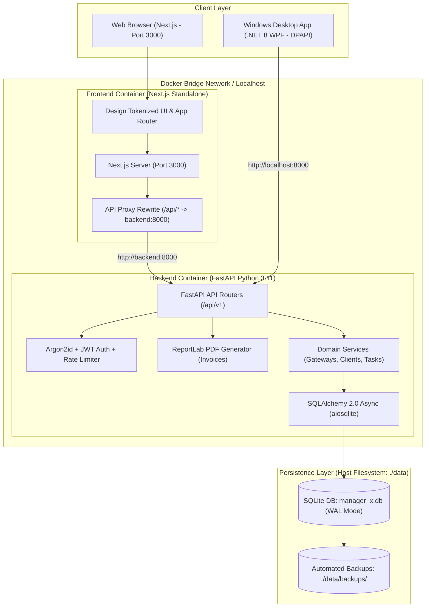
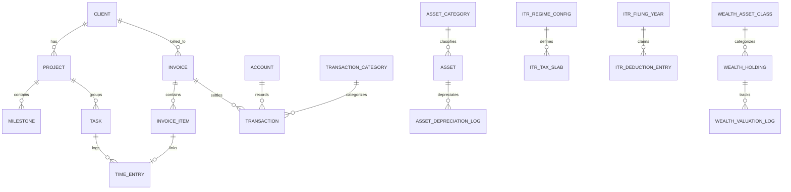

# Manager X — Architecture & Technical Design Specification

**Document Version:** 1.0.0  
**Backend:** FastAPI (Python 3.11+) + SQLAlchemy 2.0 (Async) / SQLite (WAL)  
**Frontend:** Next.js (App Router, TypeScript) + Vanilla CSS / CSS Modules / Tokenized Design System  
**State & Data Flow:** React Query (TanStack Query) + Server Actions / REST API + WebSocket (Live Timer)  

---

## 1. System Architecture Overview

Manager X adopts a decoupled, local-first architecture combining a high-performance Python ASGI backend (FastAPI), an interactive, clean Next.js frontend, a standalone Windows WPF desktop client, and production-ready Docker Compose orchestration.



---

## 2. Directory Layout

The workspace is organized as a clean monorepo with distinct separation between backend, frontend, desktop client, deployment artifacts, and local data persistence.

```
Manager-X/
├── backend/
│   ├── app/
│   │   ├── api/v1/
│   │   │   ├── endpoints/
│   │   │   │   ├── auth.py
│   │   │   │   ├── clients.py
│   │   │   │   ├── projects.py
│   │   │   │   ├── tasks.py
│   │   │   │   ├── time_entries.py
│   │   │   │   ├── invoices.py
│   │   │   │   ├── gateways.py
│   │   │   │   └── settings.py
│   │   │   └── router.py
│   │   ├── core/
│   │   │   ├── config.py             # Configurable DATA_DIR, SECRET_KEY, CORS
│   │   │   ├── cuid.py               # Standard CUID ID generator
│   │   │   ├── database.py           # Async SQLite engine & WAL pragma
│   │   │   └── security.py           # Argon2id + JWT + brute-force limiter
│   │   ├── models/                   # SQLAlchemy declarative models
│   │   │   ├── user_models.py
│   │   │   ├── client_model.py
│   │   │   ├── project_models.py     # Projects & Tasks (with checklists)
│   │   │   ├── invoice_model.py      # Invoices & Line items
│   │   │   ├── gateway_model.py      # Payment Gateways
│   │   │   └── settings_models.py
│   │   ├── schemas/                  # Pydantic v2 validation models
│   │   ├── services/
│   │   │   └── invoice_pdf.py        # ReportLab vector-sharp PDF engine
│   │   └── main.py                   # FastAPI app with health checks & CORS
│   ├── tests/                        # Comprehensive pytest async test suite
│   ├── Dockerfile                    # Production lean Python 3.11 image
│   ├── .dockerignore
│   └── requirements.txt              # FastAPI, SQLAlchemy[asyncio], greenlet, etc.
├── frontend/
│   ├── src/
│   │   ├── app/                      # Next.js App Router pages
│   │   │   ├── page.tsx              # Executive Overview Dashboard
│   │   │   ├── clients/              # Client directory & billing terms
│   │   │   ├── projects/             # Projects & tasks (tabular nested view)
│   │   │   ├── time-tracker/         # Wall-clock timer & 12-hour AM/PM entries
│   │   │   ├── invoices/             # Tabular invoices & PDF rendering
│   │   │   ├── gateways/             # Payment gateways management
│   │   │   └── settings/             # System settings modal
│   │   ├── components/
│   │   │   ├── layout/               # Header, Sidebar, AppShell, GlobalTimerBar
│   │   │   └── modules/              # Modal forms & specialized tables
│   │   ├── lib/
│   │   │   ├── api-client.ts         # Typed fetch client with cookie auth
│   │   │   └── query-client.ts
│   │   └── types/
│   ├── Dockerfile                    # Multi-stage standalone output runner
│   ├── .dockerignore
│   ├── package.json
│   └── next.config.ts                # Standalone output, dynamic backend rewrites
├── desktop/
│   └── ManagerX.Desktop/             # Standalone C# .NET 8 WPF Desktop Client
│       ├── Views/                    # TrackerView, LoginView, BackendSetupView
│       ├── Services/                 # Win32 ShutdownBlocker, DPAPI, Launcher
│       └── ManagerX.Desktop.csproj
├── data/                             # Host-mounted SQLite DB (gitignored)
│   ├── manager_x.db
│   └── backups/
├── docker-compose.yml                # Production orchestration with health checks
├── docker-start.bat                  # One-click Windows Docker launcher
├── docker-stop.bat                   # One-click Windows Docker stopper
├── DEPLOYMENT_LINUX.md               # Complete local Linux server deployment guide
├── start.bat                         # Local dev launcher (Windows)
├── stop.bat                          # Local dev stopper (Windows)
├── manager.bat                       # Interactive Windows control menu
├── .env.example                      # Dynamic port & environment configuration
└── skills/
    ├── product.md
    ├── prd.md
    ├── architecture.md
    └── memory.md
```

---

## 3. Database Schema & Relational Model

The database is built on relational SQLite with complete foreign key enforcement (`PRAGMA foreign_keys = ON;`).



### 3.0 Core Entity Identifiers & Referential Invariants

1. **All Input / Entity IDs Must Be CUID**:
   - All entity primary keys and ID inputs across the system must use **CUID** (Collision-resistant Unique Identifier, generated via `app.core.cuid.generate_cuid`).
   - CUIDs ensure chronological sortability, URL friendliness, and collision resistance without heavy external dependencies.
2. **Deletion Invariant (Cannot be deleted if already used)**:
   - Any entity, lookup item, or master record (such as Currencies, Clients, Tax Schemes, Accounts, Categories, Projects, etc.) **CANNOT be deleted if it is already in use or referenced** by any dependent records (e.g. invoices, time entries, transactions).
   - Deletion attempts on in-use entities must be strictly blocked with an explicit error detailing that the item is currently in use.
   - If an entity should no longer be available for future entries, toggle its status to inactive (`is_active = FALSE`) instead of deleting.

### 3.1 Zero-Hardcoding Core Tables

```sql
-- Dynamic configuration dictionary
CREATE TABLE system_settings (
    key TEXT PRIMARY KEY,
    value TEXT NOT NULL,
    value_type TEXT NOT NULL DEFAULT 'string', -- 'string', 'number', 'boolean', 'json'
    category TEXT NOT NULL,                    -- 'general', 'invoice', 'tax', 'ui'
    description TEXT,
    updated_at TIMESTAMP DEFAULT CURRENT_TIMESTAMP
);

-- Supported currencies (Exchange rate is NOT fixed here; runtime/snapshot rate used on invoices/transactions)
CREATE TABLE currencies (
    code TEXT PRIMARY KEY,       -- 'INR', 'USD', 'EUR', 'GBP'
    symbol TEXT NOT NULL,        -- '₹', '$', '€', '£'
    name TEXT NOT NULL,
    is_base_currency BOOLEAN NOT NULL DEFAULT 0,
    is_active BOOLEAN NOT NULL DEFAULT 1
);

-- Tax schemes (e.g., GST 18%, Zero-rated Export, VAT)
CREATE TABLE tax_schemes (
    id TEXT PRIMARY KEY,
    name TEXT NOT NULL,
    rate_percent REAL NOT NULL,
    is_split_tax BOOLEAN NOT NULL DEFAULT 0,  -- e.g. CGST (9%) + SGST (9%)
    split_details_json TEXT,                  -- '{"CGST": 9.0, "SGST": 9.0}'
    is_default BOOLEAN NOT NULL DEFAULT 0
);
```

### 3.2 Operational Tables (PM, TT, Invoices)

```sql
CREATE TABLE clients (
    id TEXT PRIMARY KEY,
    name TEXT NOT NULL,
    email TEXT,
    phone TEXT,
    company_name TEXT,
    tax_id TEXT,                    -- GSTIN/EIN/VAT
    address TEXT,
    currency_code TEXT REFERENCES currencies(code),
    hourly_rate REAL DEFAULT 0.0,
    payment_terms_days INTEGER DEFAULT 15,
    created_at TIMESTAMP DEFAULT CURRENT_TIMESTAMP
);

CREATE TABLE projects (
    id TEXT PRIMARY KEY,
    client_id TEXT REFERENCES clients(id) ON DELETE CASCADE,
    name TEXT NOT NULL,
    description TEXT,
    billing_type TEXT NOT NULL,     -- 'hourly', 'fixed', 'internal'
    hourly_rate REAL,
    budget_amount REAL,
    status TEXT NOT NULL,           -- 'active', 'completed', 'on_hold'
    start_date DATE,
    end_date DATE,
    created_at TIMESTAMP DEFAULT CURRENT_TIMESTAMP
);

CREATE TABLE tasks (
    id TEXT PRIMARY KEY,
    project_id TEXT REFERENCES projects(id) ON DELETE CASCADE,
    title TEXT NOT NULL,
    description TEXT,
    status TEXT NOT NULL,           -- 'backlog', 'in_progress', 'review', 'done'
    priority TEXT NOT NULL,         -- 'low', 'medium', 'high', 'urgent'
    estimated_hours REAL DEFAULT 0.0,
    checklist JSON DEFAULT '[]',    -- Interactive sub-task checklist items
    due_date DATE,
    created_at TIMESTAMP DEFAULT CURRENT_TIMESTAMP
);

CREATE TABLE time_entries (
    id TEXT PRIMARY KEY,
    project_id TEXT REFERENCES projects(id) ON DELETE CASCADE,
    task_id TEXT REFERENCES tasks(id) ON DELETE SET NULL,
    description TEXT,
    start_time TIMESTAMP NOT NULL,
    end_time TIMESTAMP,
    duration_seconds INTEGER DEFAULT 0,
    is_billable BOOLEAN DEFAULT 1,
    hourly_rate REAL NOT NULL,
    is_invoiced BOOLEAN DEFAULT 0,
    invoice_id TEXT REFERENCES invoices(id) ON DELETE SET NULL,
    created_at TIMESTAMP DEFAULT CURRENT_TIMESTAMP
);

CREATE TABLE payment_gateways (
    id TEXT PRIMARY KEY,
    name TEXT NOT NULL,             -- e.g. 'Razorpay', 'Stripe', 'Bank Wire'
    gateway_type TEXT NOT NULL,     -- 'stripe', 'razorpay', 'paypal', 'bank_transfer', 'custom'
    account_identifier TEXT,        -- Account ID, VPA, IBAN
    instructions TEXT,              -- Formatted wire instructions injected into PDFs
    currency_code TEXT REFERENCES currencies(code),
    is_active BOOLEAN DEFAULT 1,
    created_at TIMESTAMP DEFAULT CURRENT_TIMESTAMP
);

CREATE TABLE invoices (
    id TEXT PRIMARY KEY,
    invoice_number TEXT UNIQUE NOT NULL, -- e.g. INV-2026-001
    client_id TEXT REFERENCES clients(id),
    status TEXT NOT NULL,                -- 'draft', 'issued', 'partially_paid', 'paid', 'overdue', 'void'
    issue_date DATE NOT NULL,
    due_date DATE NOT NULL,
    currency_code TEXT REFERENCES currencies(code),
    exchange_rate_to_base REAL DEFAULT 1.0,
    subtotal REAL NOT NULL,
    tax_total REAL NOT NULL,
    discount_amount REAL DEFAULT 0.0,
    total_amount REAL NOT NULL,
    paid_amount REAL DEFAULT 0.0,
    received_amount_inr REAL,            -- Exact foreign exchange realization in INR
    payment_date VARCHAR(20),            -- Execution date of recorded payment
    is_reconciled BOOLEAN DEFAULT 0,
    bank_transaction_id VARCHAR(64),
    payment_gateway_id TEXT REFERENCES payment_gateways(id) ON DELETE SET NULL,
    notes TEXT,
    pdf_path TEXT,
    created_at TIMESTAMP DEFAULT CURRENT_TIMESTAMP
);
```

### 3.3 Financial & Asset Tables (Finance, Assets, ITR, Wealth)

```sql
CREATE TABLE accounts (
    id TEXT PRIMARY KEY,
    name TEXT NOT NULL,
    account_type TEXT NOT NULL,    -- 'bank', 'credit_card', 'cash', 'escrow'
    currency_code TEXT REFERENCES currencies(code),
    current_balance REAL DEFAULT 0.0,
    created_at TIMESTAMP DEFAULT CURRENT_TIMESTAMP
);

CREATE TABLE transactions (
    id TEXT PRIMARY KEY,
    account_id TEXT REFERENCES accounts(id) ON DELETE CASCADE,
    transaction_type TEXT NOT NULL,-- 'income', 'expense', 'transfer'
    category_id TEXT REFERENCES transaction_categories(id),
    amount REAL NOT NULL,
    transaction_date DATE NOT NULL,
    reference_number TEXT,
    notes TEXT,
    is_tax_deductible BOOLEAN DEFAULT 0,
    invoice_id TEXT REFERENCES invoices(id) ON DELETE SET NULL,
    created_at TIMESTAMP DEFAULT CURRENT_TIMESTAMP
);

CREATE TABLE assets (
    id TEXT PRIMARY KEY,
    name TEXT NOT NULL,
    category_id TEXT REFERENCES asset_categories(id),
    purchase_date DATE NOT NULL,
    purchase_price REAL NOT NULL,
    salvage_value REAL DEFAULT 0.0,
    useful_life_years REAL,
    depreciation_method TEXT NOT NULL, -- 'WDV', 'SLM'
    depreciation_rate_percent REAL NOT NULL,
    current_book_value REAL NOT NULL,
    serial_number TEXT,
    warranty_expiry DATE,
    created_at TIMESTAMP DEFAULT CURRENT_TIMESTAMP
);

CREATE TABLE wealth_holdings (
    id TEXT PRIMARY KEY,
    asset_class TEXT NOT NULL,   -- 'equity', 'mutual_fund', 'fixed_deposit', 'gold', 'crypto', 'real_estate', 'cash'
    name TEXT NOT NULL,
    ticker_symbol TEXT,
    quantity REAL NOT NULL DEFAULT 1.0,
    buy_price_avg REAL NOT NULL,
    invested_amount REAL NOT NULL,
    current_price REAL NOT NULL,
    current_valuation REAL NOT NULL,
    goal_tag TEXT,               -- 'retirement', 'emergency', 'growth'
    last_updated TIMESTAMP DEFAULT CURRENT_TIMESTAMP
);
```

---

## 4. Zero-Hardcoding Principles & Architecture

To satisfy the strict constraint of **Zero Hardcoding**:
1. **Dynamic Form Schemas**: Dropdown choices (Task priorities, Transaction categories, Currencies, Tax Schemes) are always fetched from `/api/v1/settings/*` endpoints.
2. **Dynamic Tax Slabs & Regime Calculator**:
   - The ITR engine does not hardcode slab limits in Python. Slabs are stored in `itr_tax_slabs` with `fy_year`, `regime_name`, `lower_bound`, `upper_bound`, and `rate_percent`.
   - Adding a new fiscal year or updating slabs under budget amendments requires only database record updates or UI edits, with zero code redeployment.
3. **Depreciation Formulas**:
   - Rates for Computers, Electronics, Furniture, or Vehicles are stored in `asset_categories`.
   - The engine loads the formula parameters at runtime.

---

## 5. Frontend Architecture & Design System

### 5.1 Technology Choices
- **Framework**: Next.js 14/15 (App Router).
- **Styling**: Vanilla CSS with a global CSS custom property design token system (`--bg-primary`, `--bg-surface`, `--text-primary`, `--accent-primary`, `--border-subtle`).
- **Icons**: Lucide Icons.
- **Charts**: Recharts (with accessible monospace numeric formatters).

### 5.2 Global Live Timer Architecture
- A persistent floating stopwatch component resides in the Root Layout.
- It connects to `ws://localhost:8000/ws/timer` so that timer states remain in continuous sync across multiple open browser tabs or page transitions without state loss.

---

## 6. Local-First Storage & Safety Strategy
1. **SQLite WAL Mode**:
   ```sql
   PRAGMA journal_mode = WAL;
   PRAGMA synchronous = NORMAL;
   PRAGMA foreign_keys = ON;
   PRAGMA busy_timeout = 5000;
   ```
2. **Automated Daily Backups**:
   - On backend boot and via a periodic local thread, a snapshot of `manager_x.db` is copied into `data/backups/manager_x_YYYYMMDD_HHMMSS.db`.
3. **Full JSON Export/Import**:
   - `/api/v1/settings/export` generates a single comprehensive JSON file of all data.
4. **Automatic Git Version Control**:
   - Every single atomic change to code or configuration must be automatically staged and committed into git version control immediately upon verification.

